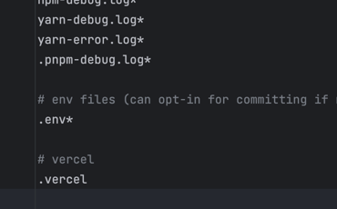

欢迎来到我的博客。

这是第一篇测试文章，用来确认：

- Markdown 文章能正常渲染
- 首页能列出文章
- 推送到 GitHub 后 Cloudflare 会自动部署

## 接下来可以做什么

1. 在 `content/posts/` 下新建 `.md` 文件
2. 写好 frontmatter（`title`、`date`、`excerpt`）
3. `git push`，等待站点更新

感谢阅读。
